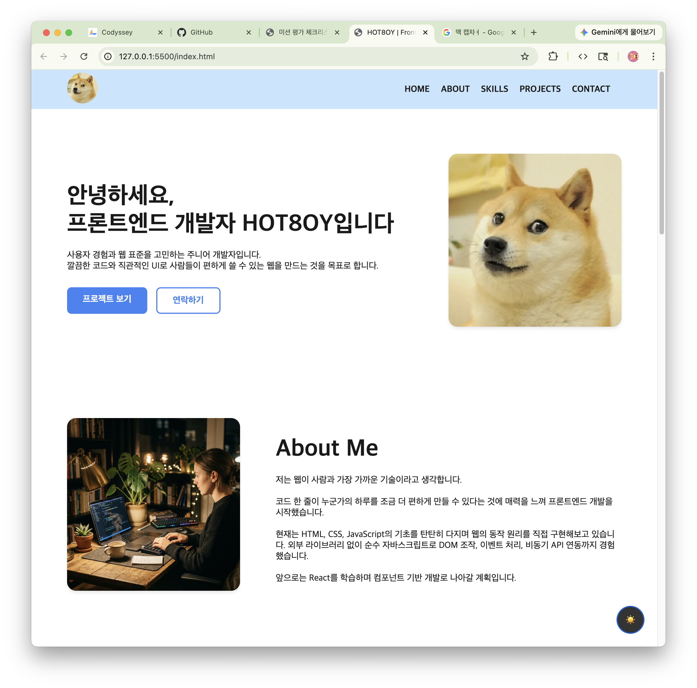
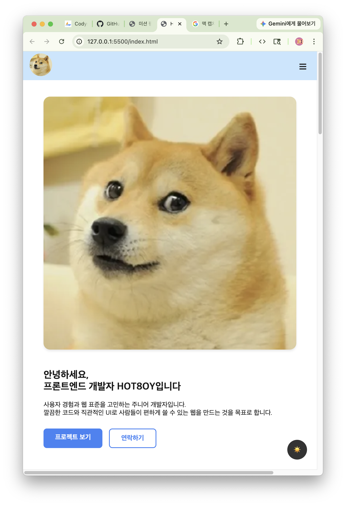
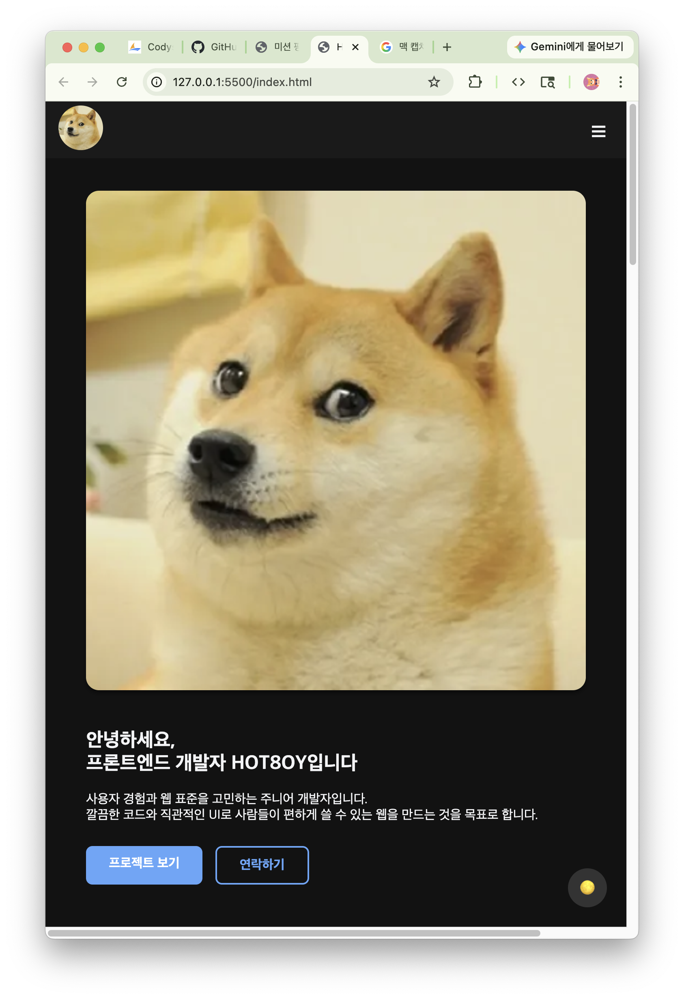

# 🌐 HOT8OY | Frontend Developer Portfolio

> 순수 HTML, CSS, JavaScript로 제작한 반응형 포트폴리오 웹사이트

🔗 **배포 URL**: [https://hot8oy.github.io/Codyssey-B1-1/](https://hot8oy.github.io/Codyssey-B1-1/)

---

## 📸 스크린샷

| 데스크톱 (Light) | 모바일 (Light) | 모바일 (Dark) |
|:---:|:---:|:---:|
|  |  |  |


---

## 📖 프로젝트 소개

외부 라이브러리(React, Vue, Tailwind 등) 없이 **순수 HTML / CSS / JavaScript**만으로 제작한 반응형 포트폴리오 웹사이트입니다.  
**"사용자 이벤트 → 전역 STATE 갱신 → 화면(DOM) 렌더링"** 흐름을 직접 구축하여, 웹의 동작 원리와 React의 핵심 철학인 상태 주도 렌더링(State-Driven Rendering)을 학습하는 것을 목표로 합니다.

---

## 🛠 사용 기술

| 분류 | 기술 |
|---|---|
| **Markup** | HTML5 (시맨틱 태그) |
| **Styling** | CSS3 — Flexbox, Grid, CSS 변수, 반응형 미디어 쿼리 |
| **Scripting** | JavaScript (ES6+) — DOM 조작, 이벤트 처리, async/await, Fetch API |
| **API** | GitHub REST API (`/users/{id}/repos`) |
| **배포** | GitHub Pages |

---

## 📂 프로젝트 구조

```
Codyssey-B1-1/
├── index.html          # 시맨틱 구조 기반 메인 페이지
├── css/
│   └── style.css       # 반응형 디자인, CSS 변수, 컴포넌트 스타일시트
├── js/
│   └── main-logic.js   # 전역 STATE 객체, 렌더 함수, 인터랙션 · API 비동기 로직
├── assets/             # 정적 이미지 리소스 (프로필, 작업공간, 기술스택 이미지 등)
└── README.md           # 프로젝트 문서
```

> [!NOTE]
> **📁 `assets/` 디렉터리 명명 안내 (요구사항 `images/` 대응)**  
> 과제 요구사항 명세서의 `images/` 디렉터리는 프로젝트 내에서 이미지뿐만 아니라 향후 아이콘, 그래픽 등 정적 에셋(Static Assets) 전반을 종합적으로 관리하기 위해 웹 프론트엔드 표준 관례에 따라 **`assets/`** 디렉터리로 구성했습니다. 본 디렉터리가 요구사항의 `images/` 역할을 온전히 수행합니다.

---

## 📐 레이아웃 기술 선택 이유 (Flexbox vs Grid)

본 프로젝트는 화면의 목적과 배치 차원에 맞춰 **Flexbox**와 **CSS Grid**를 명확한 기준을 가지고 구분하여 적용했습니다.

### 1. 네비게이션 (`#nav-container`): **Flexbox 선택**
* **선택 이유**: 네비게이션은 단일 축(가로 1차원) 상에서 로고와 메뉴 항목들을 선형으로 배치하는 것이 핵심입니다.
* **기술적 이점**:
  * `justify-content: space-between`을 통해 로고(왼쪽)와 메뉴(오른쪽)를 양 끝으로 유연하게 분할 배치할 수 있습니다.
  * `align-items: center`로 세로 중앙 정렬을 간단히 처리할 수 있습니다.
  * 모바일 화면 진입 시 `flex-direction: column`으로 변경하여 드롭다운 형태의 수직 메뉴로 손쉽게 전환할 수 있습니다.

### 2. 프로젝트 카드 목록 (`#projects-container`): **CSS Grid 선택**
* **선택 이유**: 프로젝트 카드는 가로(열)와 세로(행)가 규칙적으로 맞아떨어지는 **2차원 바둑판식 격자 배치**가 필수적입니다.
* **기술적 이점**:
  * `repeat(auto-fit, minmax(200px, 1fr))`를 적용하여, 번거로운 미디어 쿼리를 일일이 작성하지 않아도 화면 너비에 따라 카드의 열 개수와 너비가 유동적으로 늘어나고 줄어드는 **완벽한 자동 반응형 그리드**를 구축할 수 있습니다.

---

## 🧠 전역 STATE 객체 기반 상태 관리 패턴

React의 핵심 개념인 `useState`와 단방향 데이터 흐름을 순수 자바스크립트로 구현하기 위해, **하나의 전역 `state` 객체(Single Source of Truth)를 정의하고 상태 변화에 따라 화면을 다시 그리는 렌더 제어 패턴**을 적용했습니다.

```
[ 사용자 이벤트 (클릭 / 입력 / API 호출) ]
                   ⬇
       [ state 객체 데이터 갱신 ]
                   ⬇
[ 전용 렌더 함수 (renderTheme, renderProjects 등) ]
                   ⬇
          [ 화면(DOM) 업데이트 ]
```

### 전역 `state` 구조
```javascript
const state = {
    // 1) 다크모드 테마 상태 ('light' | 'dark')
    theme: localStorage.getItem('theme') === 'dark' ? 'dark' : 'light',

    // 2) 모바일 햄버거 메뉴 열림/닫힘 상태 (boolean)
    isMenuOpen: false,

    // 3) GitHub API 비동기 상태 ('idle' | 'loading' | 'success' | 'error' | 'empty')
    projects: {
        status: 'idle',
        data: [],
        error: null
    },

    // 4) Contact 폼 유효성 에러 및 전송 상태
    form: {
        errors: { name: '', email: '', message: '' },
        isSubmitted: false
    }
};
```

* **역할 분리의 이점**:
  * 이벤트 핸들러는 DOM을 직접 건드리지 않고 **오직 `state` 장부의 데이터만 수정**합니다.
  * `render*()` 함수는 오직 **`state` 장부에 적힌 데이터만 읽어서 화면을 렌더링**하므로, 화면과 데이터가 완벽히 분리되어 예측 가능하고 일관된 UI를 유지합니다.

---

## 🏛 시맨틱 태그 설계 기준 (HTML Semantics)

웹 표준과 웹 접근성(A11y), 검색 엔진 최적화(SEO)를 고려하여 의미에 맞는 태그를 설계했습니다.

* `<header>` & `<nav>`: 사이트의 최상단 브랜드 로고와 주요 메뉴 내비게이션 영역
* `<main>`: 페이지의 핵심 본문 콘텐츠 전체를 캡슐화
* `<section>`: Hero, About, Skills, Projects, Contact 등 주제별로 독립적인 콘텐츠 구역 분리
* `<article>`: Projects 섹션 내에서 동적으로 생성되는 개별 GitHub 레포지토리 카드 (독립적으로 배포/재사용 가능한 콘텐츠 단위)
* `<footer>`: 저작권 정보 및 외부 소셜 링크를 담는 하단 영역

---

## ✨ 주요 기능 및 인터랙션 기준값

### 1. 인터랙션 사양 (기준값 명시)
| 기능 | 구현 방식 | 기준값 및 설정 |
|---|---|---|
| 🍔 햄버거 메뉴 | `state.isMenuOpen` 토글 및 `renderMenu()` | 모바일 뷰(`@media < 768px`)에서 동작 |
| 🔝 스크롤 탑 버튼 | 스크롤 위치 감지 및 smooth scroll | 스크롤 **300px** 이상 시 노출 |
| 🎨 다크 모드 | `state.theme` 토글 및 `localStorage` 영구 보관 | 새로고침 후에도 테마 유지 |
| 📜 헤더 스타일 변경 | 스크롤 위치 감지 및 배경색/그림자 전환 | 스크롤 **60px** 이상 시 `.scrolled` 적용 |
| 🪄 섹션 페이드인 | `IntersectionObserver` 비동기 관찰 | 임계값(**threshold: 0.2**) 진입 시 노출 |
| 🔗 부드러운 스크롤 | `html { scroll-behavior: smooth; }` | 네비게이션 앵커 링크 부드러운 이동 |

### 2. GitHub API 연동 (비동기 처리)
- 엔드포인트: `https://api.github.com/users/HOT8OY/repos`
- `state.projects.status`에 따른 4단계 UI 분기:
  - ⏳ **로딩 중 (`loading`)**: CSS 회전 스피너 애니메이션 + 안내 텍스트 표시
  - ✅ **성공 (`success`)**: `map()`을 활용한 프로젝트 카드(`<article>`) 동적 렌더링
  - ❌ **에러 (`error`)**: 에러 메시지 + **다시 시도** 버튼 제공 (API 403 Rate Limit 예외 처리 포함)
  - 📭 **빈 상태 (`empty`)**: "표시할 프로젝트가 없습니다" 안내 문구

### 3. Contact 폼 UX 및 유효성 검사
- `submit` 시 기본 새로고침 방지 (`event.preventDefault()`)
- 필수값 검증 (이름, 이메일, 메시지 공백 검사)
- 이메일 정규표현식(`/^[^\s@]+@[^\s@]+\.[^\s@]+$/`) 검증
- 오류 발생 시 `state.form.errors` 기록 ➡️ 입력창 테두리 빨간색 강조(`.input-error`) 및 에러 문구 출력
- 실시간 타이핑(`input` 이벤트) 감지 시 해당 필드 에러 즉시 해제

---

## 🚀 로컬 실행 방법

```bash
# 1. 저장소 클론
git clone https://github.com/HOT8OY/Codyssey-B1-1.git

# 2. 프로젝트 폴더 이동
cd Codyssey-B1-1

# 3. 실행 (VS Code Live Server 확장 이용)
# index.html 파일 우클릭 -> "Open with Live Server" 선택
```

---

## ⚠️ 참고 사항

- GitHub REST API는 비인증 요청 시 **시간당 60회** 호출 제한이 있습니다. 제한 초과(403) 시 에러 UI와 함께 재시도 안내가 나타납니다.
- 본 프로젝트는 최신 **Chrome** 브라우저 환경에 최적화되어 있습니다.

---

© 2026 HOT8OY. All rights reserved.