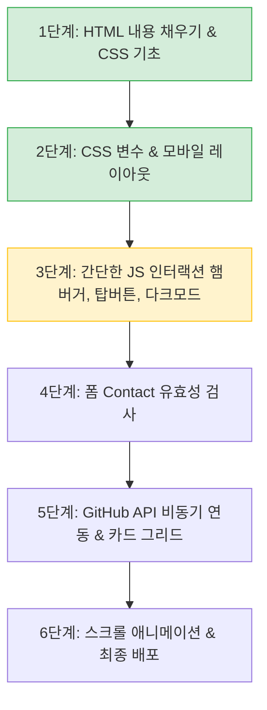

# 📋 포트폴리오 웹사이트 구현 체크리스트 & 로드맵

> 본 문서는 [mission.md](./mission.md) 요구사항을 바탕으로 작성된 기능 체크리스트 및 구현 순서 가이드입니다.

---

## 1. 구현 체크리스트

### 1) HTML 마크업 (기본 뼈대 & 접근성) - 100% 완료 🎉

- [x] 기본 폴더 및 파일 구조 분리 (`css/`, `js/`, `assets/`)
- [x] 외부 CSS 및 JS 연결 (`defer` 속성 적용)
- [x] 시맨틱 태그 구조화 (`<header>`, `<nav>`, `<main>`, `<section>`, `<footer>`)
- [x] 네비게이션 앵커 링크 연결 (`href="#hero"` 등)
- [x] Contact 폼 기본 요소 작성 (`label for` - `input id` 매칭)
- [x] Contact 폼 전송 버튼 추가 (`<button type="submit">`)
- [x] 모바일 햄버거 메뉴 버튼 추가 (`#hamburger-btn`)
- [x] 다크 모드 토글 버튼 추가 (`.floating-darkmode`)
- [x] Projects 섹션에 비동기 상태별 컨테이너 마크업 (`#projects-status`, `#projects-container`)

### 2) CSS & 스타일링 (반응형 & 디자인) - 약 70% 완료

- [x] **CSS 변수(`:root`) 정의**: 주요 색상, 배경색, 텍스트 색상, 여백 등
- [x] **다크 모드 CSS 변수 정의**: `[data-theme="dark"]` 선택자로 색상 반전 처리
- [x] 헤더 및 네비게이션 Flexbox 정렬 및 상단 고정(`position: sticky`)
- [x] 플로팅 버튼(위로가기, 다크모드) Flexbox 및 우하단 고정(`position: fixed`)
- [x] 모바일 화면에서 기존 메뉴 숨기고 햄버거 버튼 표시 (`@media (max-width: 768px)`)
- [x] 시각 효과 (버튼 hover 애니메이션, transition, shadow 변수 적용)
- [x] 부드러운 스크롤 적용 (`html { scroll-behavior: smooth; }`)
- [x] **Projects 카드 Grid 레이아웃**: `auto-fit`과 `minmax`를 활용한 반응형 카드 배치
- [x] 태블릿/데스크톱 섹션별 상세 여백 및 폰트 크기 반응형 조율

### 3) JavaScript 인터랙션 & 폼 UX - 다음 단계!

- [ ] **햄버거 메뉴 토글**: 클릭 시 모바일 메뉴 열림/닫힘 (`classList.toggle('active')`)
- [ ] **위로 가기(Scroll-to-top) 버튼**:
  - [ ] 스크롤 300px 이상 내렸을 때만 버튼 노출 (그전엔 숨김)
  - [ ] 클릭 시 부드럽게 최상단으로 이동 (`window.scrollTo`)
- [ ] **다크 모드 토글 & 상태 저장**:
  - [ ] 버튼 클릭 시 `document.body`의 `data-theme="dark"` 속성 토글
  - [ ] `localStorage`에 저장하여 새로고침 시에도 유지
- [ ] **네비게이션 스타일 변경**: 스크롤 60px 이상 시 헤더 배경색/그림자 변화
- [ ] **Contact 폼 유효성 검증**:
  - [ ] `submit` 시 기본 새로고침 방지 (`event.preventDefault()`)
  - [ ] 필수값 및 이메일 형식 검증 후 인풋 근처에 에러 메시지 표시
  - [ ] 성공 시 성공 안내 메시지 표시
- [ ] **스크롤 애니메이션**: `IntersectionObserver`로 섹션 진입 시 페이드인 효과

### 4) GitHub API 연동 (비동기 처리)

- [ ] `fetch` 및 `async/await`로 `https://api.github.com/users/{본인아이디}/repos` 호출
- [ ] `try...catch` 예외 처리 (시간당 60회 제한 등 403 에러 처리 포함)
- [ ] **상태별 UI 분기**:
  - [ ] 로딩 상태: 로딩 중 텍스트 또는 스피너 표시
  - [ ] 성공 상태: `map`을 사용해 프로젝트 카드 동적 렌더링 (이름, 설명, 별점 등)
  - [ ] 에러 상태: "프로젝트를 불러올 수 없습니다" 안내 + [다시 시도] 버튼
  - [ ] 빈 상태: 레포지토리가 없을 때 안내 문구

### 5) 배포 & 문서화

- [ ] GitHub 저장소 push 및 GitHub Pages 배포
- [ ] `README.md` 작성 (프로젝트 소개, 기술 스택, 배포 링크, 스크린샷)

---

## 2. 초심자 맞춤 추천 구현 순서

- **현재 위치**: **2단계를 마치고 3단계(JavaScript 기본 인터랙션)**로 진입할 준비가 되었습니다!
- **추천 다음 액션**: [js/main-logic.js](../js/main-logic.js)에서 방금 만든 **햄버거 메뉴 열기/닫기 토글 기능**부터 작성해보기.
