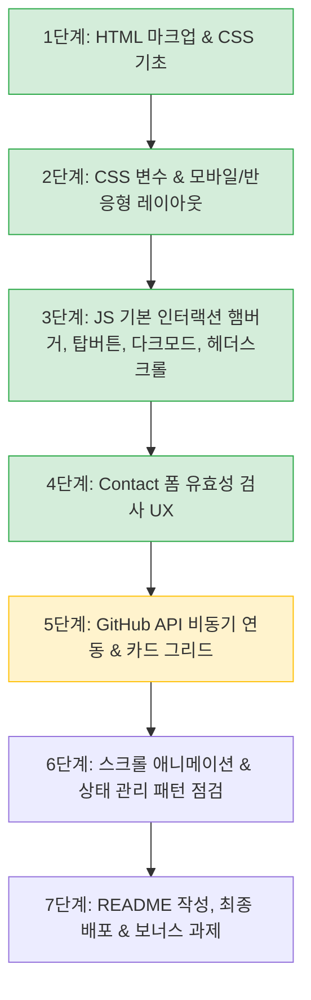

# 📋 포트폴리오 웹사이트 구현 체크리스트 & 로드맵

> 본 문서는 [mission.md](./mission.md) 요구사항을 바탕으로 작성된 기능 체크리스트 및 구현 순서 가이드입니다.

---

## 1. 구현 체크리스트

### 1) HTML 마크업 (기본 뼈대 & 접근성) - 100% 완료 🎉

- [x] 기본 폴더 및 파일 구조 분리 (`css/`, `js/`, `assets/`)
- [x] 외부 CSS 및 JS 연결 (`defer` 속성 적용)
- [x] 시맨틱 태그 구조화 (`<header>`, `<nav>`, `<main>`, `<section>`, `<footer>`)
- [x] 네비게이션 앵커 링크 연결 (`href="#hero"` 등)
- [x] Contact 폼 기본 요소 작성 (`label for` - `input id` 매칭)
- [x] Contact 폼 전송 버튼 추가 (`<button type="submit">`)
- [x] 모바일 햄버거 메뉴 버튼 추가 (`#hamburger-btn`)
- [x] 다크 모드 토글 버튼 추가 (`.floating-darkmode`)
- [x] Projects 섹션에 비동기 상태별 컨테이너 마크업 (`#projects-status`, `#projects-container`)

### 2) CSS & 레이아웃 (반응형 & 디자인) - 약 80% 완료

- [x] **CSS 변수(`:root`) 정의**: 주요 색상, 배경색, 텍스트 색상, 여백 등
- [x] **다크 모드 CSS 변수 정의**: `[data-theme="dark"]` 선택자로 색상 반전 처리
- [x] **모바일 퍼스트(Mobile-First) 레이아웃**: 모바일 기본 스타일 작성 후 미디어 쿼리로 점진적 확장
- [x] 헤더 및 네비게이션 Flexbox 정렬 및 상단 고정(`position: sticky`, 로고 좌측, 메뉴 우측)
- [x] 플로팅 버튼(위로가기, 다크모드) Flexbox 및 우하단 고정(`position: fixed`)
- [x] 모바일 화면에서 기존 메뉴 숨기고 햄버거 버튼 표시 (`@media (min-width: 768px)` 기준 분기)
- [ ] **반응형 브레이크포인트 적용**:
  - [x] 태블릿: 768px 미디어 쿼리 적용 (`@media (min-width: 768px)`)
  - [ ] 데스크톱: 1024px 미디어 쿼리 세부 레이아웃 조율 (`@media (min-width: 1024px)`)
- [x] **Projects 카드 Grid 레이아웃**: `auto-fit`과 `minmax`를 활용한 반응형 카드 배치
- [x] **컴포넌트 시각 효과 & 전환**:
  - [x] 카드 그림자 효과 (`box-shadow: var(--card-shadow)`)
  - [x] 부드러운 전환 효과 (`transition: var(--transition-speed)`)
  - [ ] 버튼 및 카드 호버(`hover`) 인터랙션 완성 (플로팅 버튼 외 일반 버튼/프로젝트 카드 hover 효과 추가 필요)
- [x] 부드러운 스크롤 적용 (`html { scroll-behavior: smooth; }`)

### 3) JavaScript 문법 & 인터랙션 & 폼 UX - 약 50% 완료

- **문법 및 코드 스타일 규칙 준수**:
  - [x] `var` 대신 `const`, `let`만 사용
  - [x] 인라인 이벤트 속성(`onclick` 등) 대신 `addEventListener` 사용
  - [x] HTML 파일 내 인라인 스타일(`style="..."`) 속성 미사용 (mission.md 필수 제약)
  - [ ] (권장) JS 상태 제어 시 `element.style` 직접 조작 대신 `classList` 토글 활용
  - [x] 화살표 함수(Arrow Function) 활용
  - [ ] 템플릿 리터럴로 동적 HTML 생성 (API 연동 시 활용)
  - [ ] 객체/배열 구조분해 할당(Destructuring) 활용 (API 연동 시 활용)
  - [ ] 배열 메서드(`map`, `forEach`) 활용 (API 연동 시 활용)
- **인터랙션 구현**:
  - [x] **햄버거 메뉴 토글**: 클릭 시 모바일 메뉴 열림/닫힘 (`classList.toggle('active')`)
  - [x] **위로 가기(Scroll-to-top) 버튼**:
    - [x] 스크롤 300px 이상 내렸을 때만 버튼 노출 (그전엔 숨김)
    - [x] 클릭 시 부드럽게 최상단으로 이동 (`window.scrollTo({ top: 0, behavior: 'smooth' })`)
  - [x] **다크 모드 토글 & 상태 저장**:
    - [x] 버튼 클릭 시 `document.body`의 `data-theme="dark"` 속성 토글
    - [x] `localStorage`에 저장하여 새로고침 시에도 테마 유지
  - [x] **네비게이션 스타일 변경**: 스크롤 60px 이상 시 헤더 배경색/그림자 변화 (`classList.toggle('scrolled')`)
  - [x] **Contact 폼 유효성 검증 & UX - 완료 🎉**:
    - [x] `submit` 시 기본 새로고침 방지 (`event.preventDefault()`)
    - [x] 필수값 검증 (빈 필드 제출 방지) 및 이메일 형식 정규표현식 검증
    - [x] 입력 필드 근처에 에러 메시지 표시
    - [x] `input` 이벤트를 통한 실시간 검증 또는 에러 제거
    - [x] 제출 성공 시 성공 안내 메시지 표시
  - [x] **스크롤 애니메이션**: `IntersectionObserver`로 섹션 진입 시 페이드인 효과 (권장 threshold 0.2 이상)

### 4) GitHub API 연동 (비동기 처리)

- [ ] `fetch` 및 `async/await`로 `https://api.github.com/users/{본인아이디}/repos` 호출
- [ ] `try...catch` 예외 처리 (시간당 60회 제한 등 403 에러 처리 포함)
- [ ] **상태별 UI 분기**:
  - [ ] 로딩 상태: 로딩 중 텍스트 또는 스피너 표시
  - [ ] 성공 상태: `map`을 사용해 프로젝트 카드 동적 렌더링 (이름, 설명, 별점 등)
  - [ ] 에러 상태: "프로젝트를 불러올 수 없습니다" 안내 + [다시 시도] 버튼
  - [ ] 빈 상태: 레포지토리가 없을 때 안내 문구

### 5) 상태 관리 패턴 (핵심 평가 기준)

- [ ] **"사용자 이벤트 → 상태 변경 → 화면 렌더링" 흐름 3가지 이상 확립**:
  - [x] **흐름 1 (다크 모드)**: 토글 클릭 → 테마 상태 변경 (`data-theme`, `localStorage`) → 화면 전체 스타일 변경
  - [ ] **흐름 2 (GitHub API)**: 데이터 요청 → 로딩/성공/에러/빈 상태 변경 → Projects 섹션 UI 분기 렌더링
  - [x] **흐름 3 (폼 유효성)**: 사용자 입력/제출 → 유효성 상태 검증 → 에러/성공 메시지 동적 표시

### 6) 배포 및 문서화 (README.md)

- [ ] GitHub 저장소 push 및 GitHub Pages 배포 완료 (외부 접속 URL 확보)
- [ ] 배포 URL에서 모든 기능 정상 동작 검증 (반응형, 인터랙션, GitHub API, 폼 유효성)
- [ ] **`README.md` 필수 작성 항목**:
  - [ ] 프로젝트 소개 및 사용 기술 명시
  - [ ] 배포 사이트 URL 명시
  - [ ] **스크린샷 3종 첨부**: 데스크톱 화면, 모바일 화면, 다크 모드 화면
  - [ ] **커스텀 기준값 명시**:
    - [ ] 스크롤 탑 버튼 노출 기준값 (예: 300px)
    - [ ] 네비게이션 배경 변화 기준값 (예: 60px)
    - [ ] 스크롤 애니메이션 Intersection Observer 임계값 (예: threshold 0.2)

### 7) 보너스 과제 (선택)

- [ ] 프로젝트 언어별 필터링 버튼 (`array.filter()`)
- [ ] Hero 섹션 타자기(타이핑) 효과
- [ ] Contact 폼 실제 이메일 전송 (Formspree 또는 EmailJS 연동)
- [ ] 시스템 다크 모드 감지 (`prefers-color-scheme` 미디어 쿼리)

### 8) 개발 환경 & 제약 사항 최종 점검

- [x] 순수 바닐라 HTML, CSS, JavaScript만 사용 (React, Vue, jQuery, Bootstrap, Tailwind 등 외부 라이브러리 사용 금지)
- [x] 허용된 외부 리소스만 사용 (Google Fonts, Font Awesome 등 웹폰트/아이콘)
- [x] 코드 제약 준수 (`var` 미사용, 인라인 이벤트 속성 미사용)
- [ ] 최신 Chrome 브라우저 기준 정상 동작 확인

---

## 2. 초심자 맞춤 추천 구현 순서

- **현재 위치**: **4단계(Contact 폼 유효성 검사 UX)를 완벽하게 완료하고, 5단계(GitHub API 비동기 연동 & 카드 그리드)**에 진입할 준비가 되었습니다!
- **추천 다음 액션**: GitHub API(`https://api.github.com/users/{본인아이디}/repos`)를 `fetch`와 `async/await`로 호출하여 Projects 섹션에 동적 카드를 렌더링하거나, `IntersectionObserver` 스크롤 애니메이션 구현하기.
